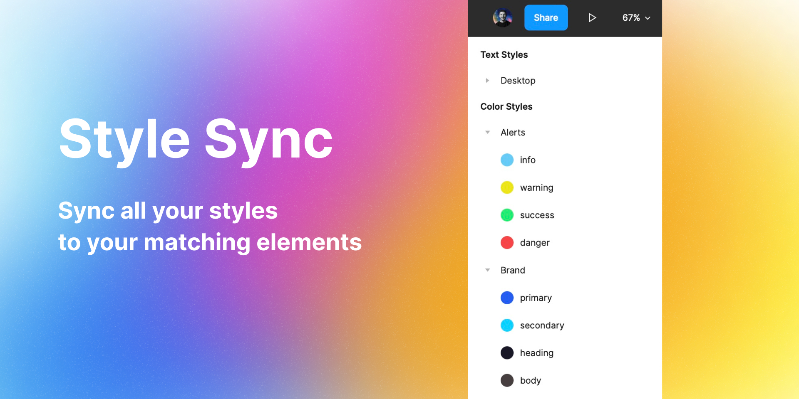

**Table of Contents:**

* [Style Sync](#style-sync)
* [User Guide](#user-guide)
* [Contribution](#contribution)
* [Project setup](#project-setup)

# Style Sync

[Figma plugin link](https://www.figma.com/community/plugin/1134483555861502888/Style-Sync)

This is a plugin for Figma that apply styles in your entire projects files to elements that match those styles properties automaticly.
## User Guide

When running the plugin, you will be prompted to seclect a style category to apply to your elements.
Select the category that you want to apply to your elements, then click on the "Apply" button.


### Colors

Apply your colors styles to each element with the same sRBG value. For example, if you have a style called `brand-blue` with the value `#235DF2`, you can apply it to all elements with the same value.


## Contribution

You can contribute to this project by:
- creating an issue
- starting a discussion
- sharing ideas
- etc

Please reade our[ code of conduct](https://github.com/maximedaraize/style-sync/blob/develop/.github/CODE_OF_CONDUCT.md)

## Project setup

Below are the steps to get your plugin running. You can also find instructions at:

  https://www.figma.com/plugin-docs/setup/

This plugin template uses Typescript and NPM, two standard tools in creating JavaScript applications.

First, download Node.js which comes with NPM. This will allow you to install TypeScript and other
libraries. You can find the download link here:

  https://nodejs.org/en/download/

Next, install the dependencies

```bash
pnpm install
```

Then to run the project run:

```bash
pnpm run dev
```

and voilà 🎉
